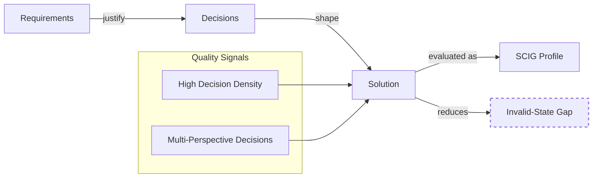

# Visualization: From Requirements to SCIG Reduction

The following diagram shows the high-level flow from **requirements** to **decisions** to **solutions**, and how **decision density** and **multi-perspective coverage** relate to SCIG (Systemic Continuous Invalid-state Gap).

**Reading the diagram:**

- Requirements (`R`) **justify** decisions (`D`) via `dec:justifiedBy`.
- Decisions **shape** the solution (`S`) via `fort:hasDecision`.
- The solution is associated with a SCIG profile (`SCIG`) using `scig:hasSCIGProfile`.
- Two key quality signals feed the solution:
  - **High Decision Density** – most decisions trace back to explicit requirements.
  - **Multi-Perspective Decisions** – decisions are reviewed from multiple perspectives.
- Together, these signals **reduce the invalid-state gap** (`G`), ideally driving `scig:invalidStateGap` toward zero.

You can extend this diagram with additional Fort dimensions (stakeholders, risk vectors, energy gradients, etc.) as needed.
